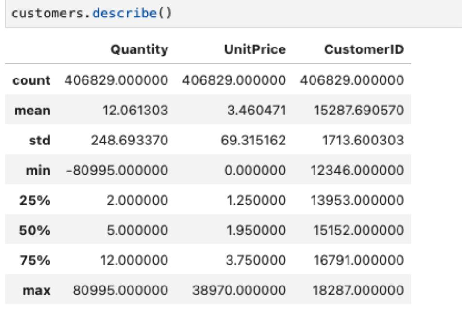

# Programming Toolbox

****
Lect. Dr. Ioan Badarinza

Email: ioan.badarinza@cs.ubbcluj.ro

Teams Code: 6evh5p0

---

## General Course Requirements:

The final mark is computed by using the following formula:

**FinalMark = 50% * Project Grade + 50% * LabsGrade**

---

## Course Structure

- **14 lectures**: weekly lectures with lots of examples
  Around week 6-7 you will receive a project that you will have to present in the 14th week, during the lecture
- **7 Labs**: Every other 2 weeks
  You will receive 4 assignments which you will have to present during the lab

## Intended Learning Outcomes

- **ILO1** Be able to use and apply basic machine learning tools
- **ILO2** Be able to use web programming to interact with machine learning tools
- **ILO3** Be able to make and report appropriate inferences from the results of applying basic tools to data
- **ILO4** Be able to work as part of a team

## Lab Assignments

The lab mark is the average of the marks the student gets on the labs resolved during the semester. A student gets the
mark 1 for a missing lab (i.e. a lab not shown to the professor). Each week past the deadline will decrease with 1 point
the maximum mark a student can get for that lab.

---

### 1. HTML + CSS + JS assignment

Create a web page for your personal profile. The page should have three sections:
The first section (which should also be the main section (“index.html”/home section)) should contain information about
yourself: name, date of birth, education, places you’ve lived, etc. (information that you also have on your personal
Facebook page).
The second section should contain information about your professional work experience/education (which you also have
on your Linkedin profile).
And the third section should contain information about your hobbies/passions etc.
The page should have a clean design (of your choice) and should contain at least 3 relevant animations (done with CSS)
(of your choice).
The details (name, date of birth, etc.) you expose on this page should be kept in one or multiple (at your choice) JSON
objects in a javascript file. You should take that information and build the HTML document dynamically (create HTML
elements/tags dynamically).
You can use any CSS & JS library that you want.

Evaluation criteria:

- 1p by default
- 2p if you have the 3 sub-pages (sections) with relevant information
- 2p for design
- 2p for CSS animations
- 3p for using JS to build/create the HTML document dynamically (if you only populate the HTML tags with data from the
  JSON file you will get only 2 points)

**Deadline Lab 3.**

---

### 2. Python assignment

Starting from the previous assignment (“1. HTML+CSS+JS Assignment”), we need to create a backend. Before, you had to
keep all the data in a JSON object, and now we are moving that data to a database (SQLite is not accepted). Create a database with three tables,
one containing data displayed in each section (e.g.: personal data, work experience, and hobbies). Create 3 APIs that
will return this data. Use these APIs to get the data on UI for each particular section.

Evaluation criteria:

- 1p by default
- 3p for creating the database and the tables containing the proper data
- 3p for creating the 3 APIs
- 3p for using these APIs on the UI

**Deadline Lab 4.**

---

### 3. Scikit-learn

For this project, you will have to work in **teams of two.**

1. You will have to fill
in [this document](https://docs.google.com/spreadsheets/d/1e5Pcr07PYe-L9X1skOxgqxUbduMZiNRkbmlQyvrf2P0/edit?gid=0#gid=0)
with the required data as follows:

- Team Name - choose a name for your team
- Member 1 and Member 2 - the names of the members of your team
- Dataset for Regression Algorithm - add the name and link to the dataset that you are using for the regression
  prediction
- Dataset for Classification Algorithm - add the name and link to the dataset that you are using for the classification
  prediction
- Dataset for Clustering Algorithm - add the name and link to the dataset that you are using for the clustering
  prediction
- Comments - any additional comments/questions

2. Choose 3 datasets from wherever you want. I recommend [https://www.kaggle.com/](https://www.kaggle.com/) which is a
platform where you can find a lot of datasets for free. Check the previous document to see if the database you want to
use is not already used by another team. In that case, you have to use a different dataset.

- Choose a dataset on which you will be able to apply the Regression Algorithm
- Choose a dataset on which you will be able to apply the Classification Algorithm
- Choose a dataset on which you will be able to apply the Clustering Algorithm
-

When choosing the datasets, make sure that you will be able to apply the prediction algorithms that you have to use for
this.

3. For each dataset create a Google Colab (or JupyterLab) Notebook that will contain the following:

- Perform thorough data analysis (this should include at least 1 or 2 types of charts)
- Perform any type of data transformation/cleaning (if needed)
- Build the Model using the specified algorithm type: Regression/Classification/Clustering
- (for 2026) use at least 2 models and comper their resutls
- Make some predictions
- Evaluate the predictions

This assignment will be presented by both members during the lab.

Evaluation criteria:

- 1p by default
- 3p for the Regression Algorithm Notebook
    - 1p - data analysis + data transformation
    - 1p - building the model and making predictions
    - 1p - evaluating the model
- 3p for the Classification Algorithm Notebook
    - 1p - data analysis + data transformation
    - 1p - building the model and making predictions
    - 1p - evaluating the model
- 3p for the Clustering Algorithm Notebook
    - 1p - data analysis + data transformation
    - 1p - building the model and making predictions
    - 1p - evaluating the model

**Deadline lab 5.**

---

### 4. Python & Scikit-learn assignment

Pick one of the datasets (together with its model) from Assignment 3, and create a web application for it. You will have
to save the model from Assignment 3 and load it (do not train it every time you have to do a prediction). A user should 
log in before using the application. Make sure that multiple users 
can use the application in the same design of the web application is very important and it needs to be user-friendly. 
You can use any Javascript framework, any CSS framework, and any Python framework that you’d like.
The application should have the following features (suggestion: you can create 1 API/REST endpoint for each point):

The user should have the possibility to:

1. See the number of rows and columns of the dataset (you can use the “shape” property from the Pandas data frame)
2. Have a link/button and when he/she clicks on it, the application should display all the column names and their
   details
   from the dataset. (you can use the “dtypes” property from the Pandas data frame )

3. Have a link/button and a numeric input to be able to extract the first N rows from the dataset. The rows should be
   displayed
   in a table. (you can use the “head” function from the Pandas data frame). Something similar to the following
   screenshot.
   4Have a link/button and a numeric input to be able to extract the last N rows from the dataset. The rows should be
   displayed in
   a table. (you can use the “tail” function from the Pandas data frame). Something similar to the following screenshot.

5. Have a link/button and when he/she clicks on it, he should see some basic statistics of the dataset. (you can use the
   “describe”
   function from the Pandas data frame). The data should be displayed in a table similar to the following screenshot:

6. Have a way to input some data and a link/button and when he/she clicks on it, that data is sent to the server, and the
   server
   will use the trained model to make a prediction and return that prediction back and display it to the client.

Evaluation criteria:

- 1p by default
- 2p for design and authentication & authorization
- 1p for feature 1
- 1p for feature 2
- 1p for feature 3
- 1p for feature 4
- 1p for feature 5
- 2p for feature 6

**Deadline Lab 6.**

---

## Project

Create a web application for managing a dataset. A user should log in before using the application. The design 
of the web application is very important ,and it needs to be user-friendly.  Also, make sure that multiple users 
can use the application at the same time. The application should have the following features:

The user should:

1. Be able to upload a CSV file containing the data

2. See the number of rows and columns of the dataset (you can use the “shape” property from the Pandas data frame)

3. Have a link/button and when he/she clicks on it, the application should display all the column names and their
   details
   from the dataset. (you can use the “dtypes” property from the Pandas data frame )

4. Have a link/button and a numeric input to be able to extract the first N rows from the dataset. The rows should be
   displayed
   in a table. (you can use the “head” function from the Pandas data frame). Something similar to the following
   screenshot.

5. Have a link/button and a numeric input to be able to extract the last N rows from the dataset. The rows should be
displayed
in a table. (you can use the “tail” function from the Pandas data frame). Something similar to the following screenshot.

6. Have a link/button and when he/she clicks on it, he should see some basic statistics of the dataset. (you can use the
“describe” function from the Pandas data frame). The data should be displayed in a table similar to the following
screenshot:

7. Have a link/button and when the user clicks on it, all the empty value rows will be removed from the dataset. (you can
use the “dropna” function from the Pandas data frame)
8. Have a way to choose the columns that will be provided to an AI algorithm as features.
9. Have a way to transform/normalize the dataset using the “get_dummies” function and the “fit_transform” function from
the OrdinalEncoder (sklearn.preprocessing)
10. Have a way to train 3 different types of AI algorithms based on the uploaded dataset:
- a. Regression algorithm
- b. Classification algorithm
- c. Clustering algorithm

For example, for this feature, you can have a list from which the user can select what algorithm he/she can choose to
train/fit and use later on.

11. Have a way to input some data and a link/button and when he/she clicks on it, that data is sent to the server and the
server will use the trained model to make a prediction and return that prediction back and display it to the client.
For example, you can have some inputs generated automatically based on the columns the user chooses at step 8 (when
he/she selects the columns that will be provided as features for the algorithm).

Evaluation criteria:

- 1p by default
- 1.5p for design and authentication & authorization
- 1-9 - 2.5p
- 10 - 2.5p
- 11 - 2.5p

---
